# SHOPPING_LIST

Mobile application developed with **Flutter and Dart** that allows users to create and manage a grocery shopping list. Users can add grocery items with a name, quantity, and category, mark items as purchased, and remove items from the list. The application uses Firebase Realtime Database through its REST API to persist grocery data.

## Preview

<div align="center">
<table>

<tr>
  <td colspan="3" align="center">
    <h3>Empty, Error, and Add Item Screens</h3>
  </td>
</tr>

<tr>
  <td>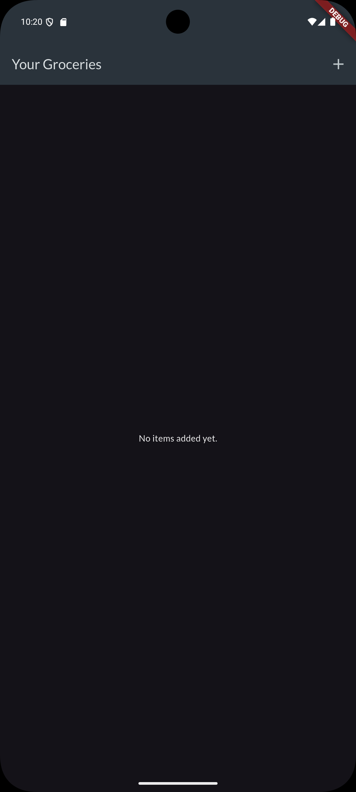</td>
  <td>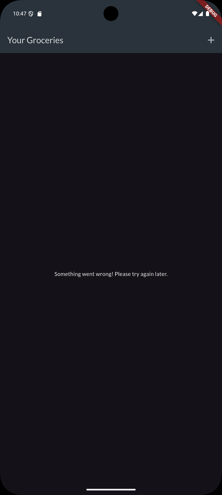</td>
  <td>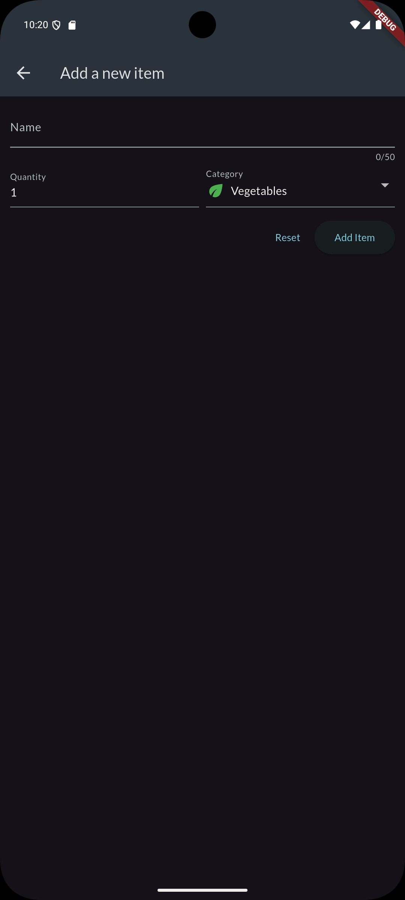</td>
</tr>

<tr>
  <td colspan="3" align="center">
    <h3>Add Items</h3>
  </td>
</tr>

<tr>
  <td>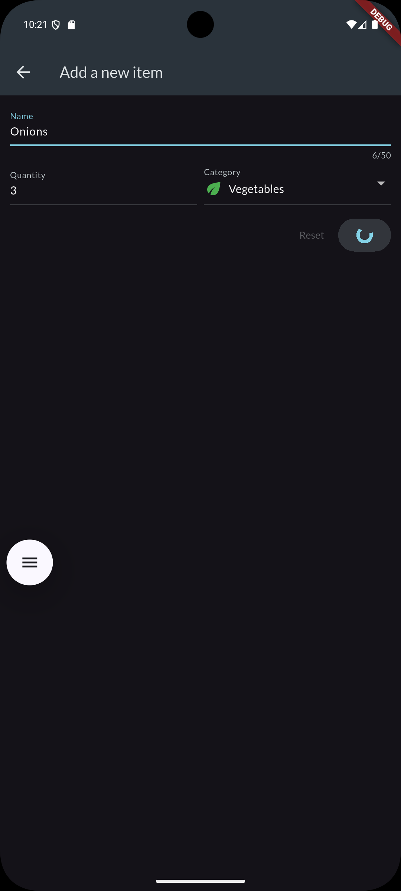</td>
  <td>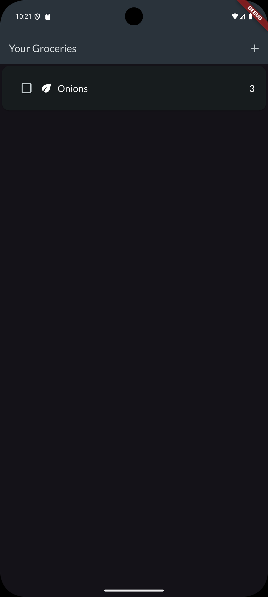</td>
  <td>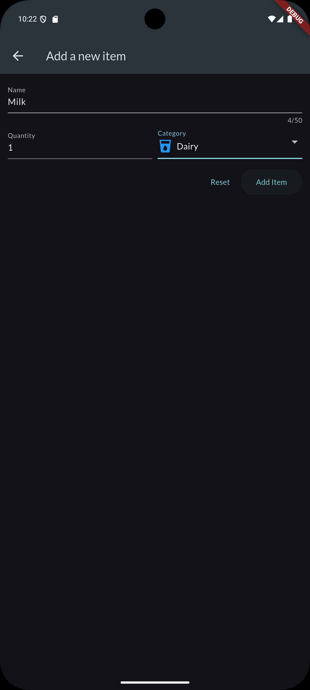</td>
</tr>

<tr>
  <td>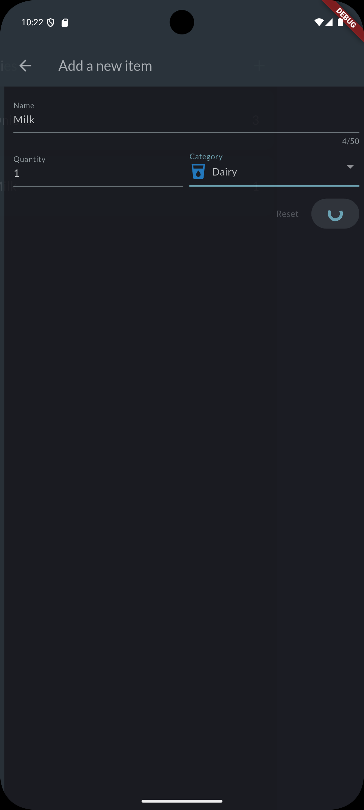</td>
  <td>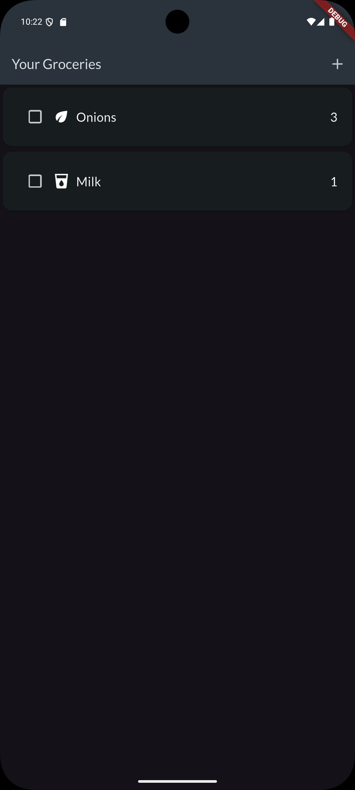</td>
  <td>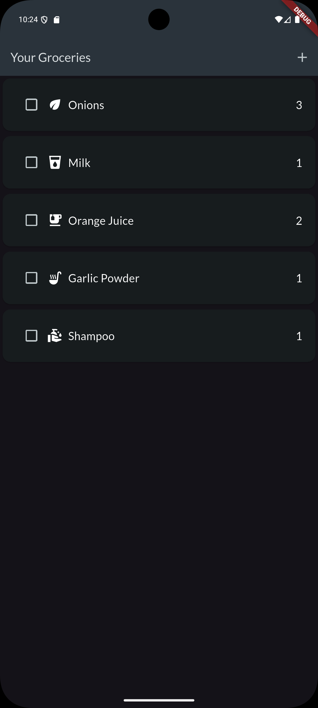</td>
</tr>

<tr>
  <td colspan="3" align="center">
    <h3>Remove Items and Checkboxes</h3>
  </td>
</tr>

<tr>
  <td>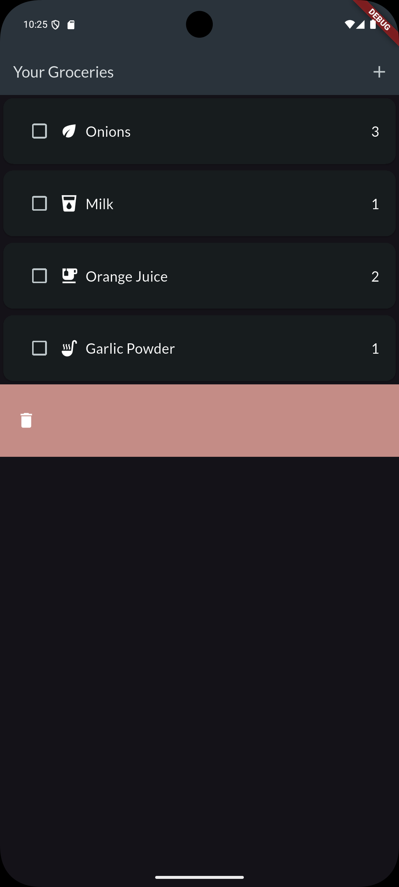</td>
  <td>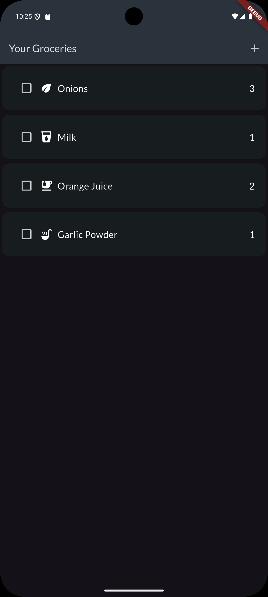</td>
  <td>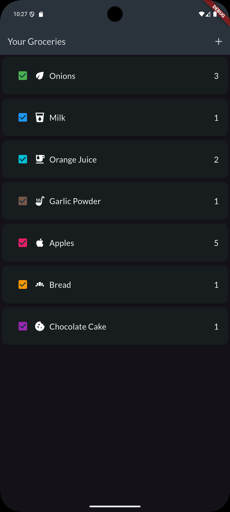</td>
</tr>

</table>
</div>

## Features

- Display grocery items stored in Firebase Realtime Database
- Add new grocery items
- Specify item quantity
- Assign a category to each grocery item
- Display category-specific icons and colors
- Mark grocery items as purchased
- Remove grocery items using swipe gestures
- Restore an item if the deletion request fails
- Handle loading and error states
- Display an empty-state message when no items are available
- Persist data using Firebase Realtime Database REST API
- Environment variables for local configuration
- Material 3 design
- Responsive layout for different screen sizes

## Technologies

- Flutter
- Dart
- Material 3
- HTTP
- Firebase Realtime Database REST API
- flutter_dotenv
- Google Fonts
- Android

## Test Device

- **Device:** Pixel 8 x86_64
- **Operating System:** Android 15 (Vanilla Ice Cream)

## Installation

1. Clone the repository:
   ```bash
   git clone https://github.com/IsaPortuguez/Shopping_List.git

2. Navigate to the project directory:

    ```bash
    cd shopping_list

3. Install dependencies:

    ```bash
    flutter pub get

4. Run the application:

    ```bash
    flutter run

## Usage
- View the current grocery items.
- Tap the + button to add a new item.
- Enter the item's name and quantity.
- Select a category.
- Tap Add Item to save the item.
- Tap the checkbox to mark an item as purchased.
- Swipe an item to remove it from the shopping list.
- If an error occurs while loading the data, an error message is displayed.
- If the shopping list is empty, an empty-state message is displayed.

## Project Structure

```text
SHOPPING_LIST/
├── assets/
│   └── screenshots/                  # Images used in the README
├── lib/
│   ├── models/
│   │   ├── category.dart              # Grocery categories and category data
│   │   └── grocery.dart               # Grocery item model
│   ├── screens/
│   │   ├── groceries_screen.dart      # Main shopping list screen
│   │   └── new_item_screen.dart       # Add new grocery item screen
│   ├── widgets/
│   │   └── groceries/
│   │       ├── groceries_list.dart     # Grocery list widget
│   │       └── grocery_item.dart       # Individual grocery item
│   └── main.dart                      # Application entry point
├── android/                           # Native Android code
├── ios/                               # Native iOS code
├── linux/                             # Linux support
├── macos/                             # macOS support
├── web/                               # Web support
├── windows/                           # Windows support
├── test/                              # Automated tests
├── .env.example                       # Example environment configuration
├── .gitignore                         # Files ignored by Git
├── pubspec.yaml                       # Dependencies and project configuration
└── README.md                          # Project documentation
```

## Project Status

✅ Completed (learning project)

## Author

Developed by Isabel Portuguez Calderon
GitHub: https://github.com/IsaPortuguez

## Notes 

This project was created for educational purposes as an introduction to mobile app development using Flutter.

## Acknowledgements

This app was created following a course on Udemy:  
[Flutter & Dart - The Complete Guide [2025 Edition]](https://www.udemy.com/course/learn-flutter-dart-to-build-ios-android-apps/)

Special thanks to the instructor for the guidance.

## Resources

If you're new to Flutter, these resources might help you:

- [Write your first Flutter app](https://docs.flutter.dev/get-started/codelab)
- [Flutter Cookbook](https://docs.flutter.dev/cookbook)
- [Flutter Documentation](https://docs.flutter.dev/)
